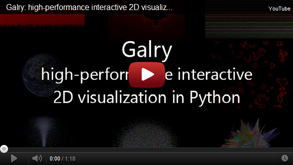

Welcome to Galry: an high performance interactive 2D visualization package in Python
====================================================================================

**Important note: Galry is still an experimental project with an unstable
programming interface that is likely to change at any time. Do not use it in
production yet.**

What is Galry?
--------------

Galry is an **high performance interactive 2D
visualization package in Python**. It is based on PyOpenGL and Numpy and is
meant to work on any platform (Window/Linux/MacOS).

Mandatory dependencies include Python 2.7, Numpy, PyQT or PySide, PyOpenGL,
matplotlib.

Optional dependencies include IPython, hdf5, PyOpenCL (the last two are not
currently used but may be in the future).

I want to see a demo!
---------------------

Why Galry?
----------

Most visualization packages in Python are either meant to generate high-quality
publication-ready figures (like matplotlib), or to offer 3D fast interactive 
visualization (like mayavi).
Existing 2D plotting packages do not generally offer an efficient way to 
interactively visualize large datasets (1-10 million points, possibly more). 
The main goal of Galry is to provide the most optimized way of visualizing
large 2D datasets, by using the full power of the graphics card.

How fast is it?
---------------

Performance and speed are the major objectives of Galry. The Python overhead
is minimized so that performance is only limited by the power of the
graphics card. We can approximately assess the performance of Galry by
measuring the number of frames per second (FPS) when navigating in a scene
containing a large number of points.

*More systematic and automatic  benchmark methods will be considered in the 
near future.*

On a 3-years old laptop with a modest graphics card, I am able to
navigate into a one million points dataset at ~70 FPS, and five million points
at ~15 FPS (see the benchmarks folder).

The [benchmark page](wiki/Benchmark) contains more details. Users are invited
to do their own benchmark.

What can I do with Galry?
-------------------------

You can either:

  * Visualize large 2D datasets consisting of points, lines or textures,
    and pan/zoom smoothly into your data.
    
  * Create your own customized GUI designed for highly efficient specialized
    interactive visualization of large 2D datasets.
    
Galry is fully customizable, and you can either write a specialized scientific
visualization GUI, a particle system, a fractal viewer, or even a video
game!

### Custom visualization

The library gives you full control on the rendering pipeline process, through
the use of vertex and fragment shaders. Shaders are small programs written in
a simple C-like low-level language ([GLSL](http://en.wikipedia.org/wiki/GLSL)) 
that are dynamically compiled on the GPU.
They transform the raw data stored in GPU memory to pixels on the screen.
Learning and using GLSL lets you exploit the full power of the GPU for
the most optimized possible way of rendering data.

Helper functions are also included for common tasks such as displaying
lines, points, polygons, textures, sprites, and text.

### Custom interactivity

The library gives you full control on the interaction system.
*User actions* such as mouse clicks, mouse mouvements, keystrokes, etc., 
can be linked to arbitrary *interaction events* such as panning, zooming, etc.
You can define new interaction events and decide how exactly they interfere
with rendering. Possible uses include selection of objects, layout
modifications, etc.

### Integration in QT

Galry provides a QT widget written in Python displaying an OpenGL rendering
viewport. This widget contains your data. It can also interact with other
QT widgets within a single application, in particular through the use of 
QT signals and slots. These are the normal way QT widgets talk to each other,
and they allow the development of a full visualization GUI with one or
several Galry widgets. The Galry interaction system can be easily linked
to the QT interaction system based on signals and slots.

Integration with other GUI systems like TKinter or wx, might be considered
as some point. The only constraint is that this system provides an OpenGL
context.

How does it work?
-----------------

Galry is written directly on top of PyOpenGL, a Python wrapper to OpenGL.
OpenGL is a widely used hardware-accelerated open library implemented in
virtually every graphics card. As of today, it is probably the most efficient
portable low-level library for interactive rendering.

Whereas OpenGL provides a low-level API for rendering, Galry offers a
plotting-oriented interface, allowing to render points, lines, textures,
sprites and text. However, you can also use lower-level functions that
give you full control about the data you put on GPU memory, and how this data 
is transformed into pixels through vertex and fragment shaders.

How to get started?
-------------------

Once you've read this introduction, there are several sources of documentation:

  * The user guide: a high-level overview of the library. It's a good starting 
    point if you prefer a top-down approach.
    
  * The tutorials: hands-on tutorials to start galrying now. They're a good
    starting point if you prefer a bottom-up approach. They contain more 
    technical details than the user guide. It is recommanded that you go
    through both the user guide and the tutorials anyway.

  * The examples: they cover a wide range of Galry's possibilities.
    
  * The API reference: once you know the fundamentals, use the reference
    if you want to go deeper into Galry.
    
The [installation page](wiki/Installation) also contains details on how
installing Galry. As of now, Galry is still an experimental library and
installation may not be straightforward depending on your software and
hardware setup.
    
    
How did this project start?
---------------------------

We created this project as part of the development of a specific
electrophysiological data GUI that will handle very large datasets.

I want to participate!
----------------------

Send me an e-mail.

Why this name?
--------------

Don't even ask.

